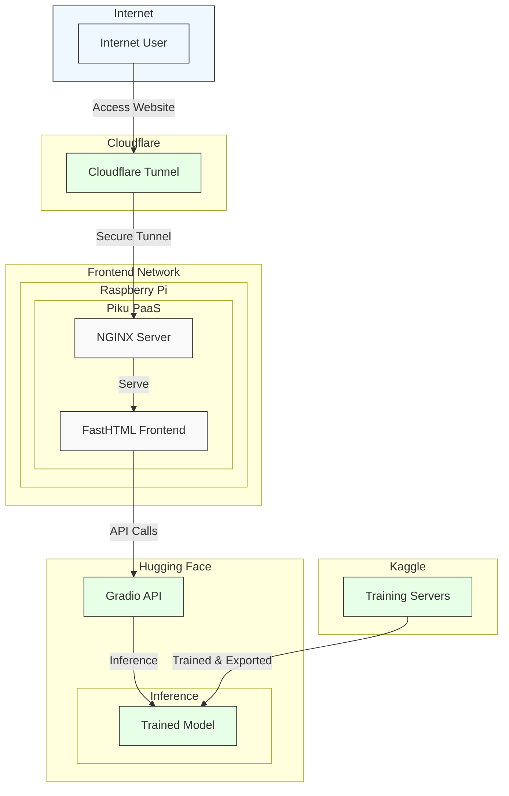

This document is a brainstorm 🧠⛈️ on system design and the systematic approach to implementing this project. Not to be confused with "ML architecture" which is sometimes used as a synonym to describe the template or structure of the **model**.

## TODOs

- frontend, backend, data layer, etc., what does this look like for an app like this?
  - my gut feeling is I can make this as simple as I want but what does a productionized web app using ML look like behind the scenes?
- use mermaid diagrams to communicate typical access pattern (really just one function)
  - also use to help illustrate concepts for others and myself

## Components

### Frontend Stack

• Raspberry Pi: Acts as home server hosting the application
• Piku: A lightweight Platform-as-a-Service (PaaS) running on Raspberry Pi
• NGINX: Web server that handles HTTP requests and serves content
• FastHTML: Python frontend application/framework

### Network & Connectivity

• Cloudflare Tunnels: Securely exposes server to the internet without opening firewall ports

### Backend & AI (Cloud)

• Hugging Face: Hosts ML model for inference
• Gradio Client API: Provides the interface between frontend and the model
• Kaggle: Where I initially trained the model before deployment

## Roadmap

### 1. Data Collection and Project Components ✅

- Decide on a data set. Going to pick 1 of:
  - UrbanSound8K
  - ESC-50
- Libraries for spectrogram generation:
  - PyTorch Audio (torchaudio)
  - Librosa
- Decide on spectrogram parameters (FFT size, window type, hop length)

### 2. Model Selection and Training: ✅

This section will be applying a lot of the content in lessons 1 & 2 of "Practical Deep Learning for Coders". Training & testing model on Kaggle.

- Starting with a pretrained CNN (convolutional neural network) that works well for image classification
  - fast.ai introduced me to ResNet so I'll start looking there
- Adapt model for spectrogram classification
- Fine-tune on spectrograms with appropriate labels
- Evaluate performance on validation set

### 3. Prototype Development ✅

I'll use Hugging Face spaces to do POC for myself and full stack deployment later. The goal here is to get a sense of how our app looks when it's all put together.

- Create a simple prototype to process a single audio file to a spectrogram
- Export model from Kaggle to use on Hugging Face
- Use the model and classify the spectrogram

### 4. Iterate on Prototype ✅

- Use the FastHTML web framework to create the frontend
- Processing pipeline:
  - audio processing (convert uploaded audio to the right format)
  - spectrogram generation
  - model inference
  - display results
- Error handling

### 6. Testing and Deployment (👷🏻‍♂️ in progress)

- Deploy to platform of my choice
