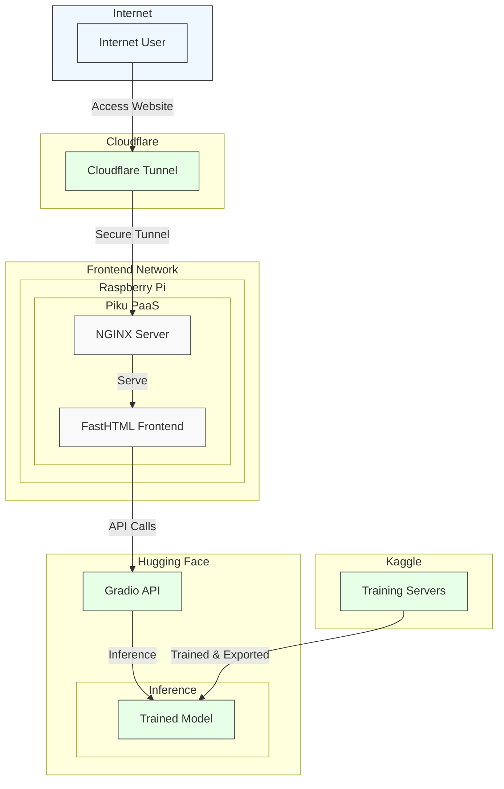

# SonicSight

Takes simple audio files, generates a spectrogram and uses an image classification model to identify the sound. Created this web application to display the model I trained, applying lessons 1 & 2 of the [fast.ai course](https://course.fast.ai). Currently, the model is trained to only recognized dog & cat sounds.

## Components

### Frontend

- FastHTML: Python frontend application/framework
- Raspberry Pi: Acts as home server hosting the application
- Piku: A lightweight Platform-as-a-Service (PaaS) running on Raspberry Pi
- NGINX: Web server that handles HTTP requests and serves content

### Network & Connectivity

- Cloudflare Tunnels: Securely exposes server to the internet without opening firewall ports

### Backend & AI (Cloud)

- Hugging Face Space: Hosts ML model and backend server for inference
- Gradio Client API: Provides the interface between frontend and the model
- Kaggle: Where I initially trained the model before deployment
