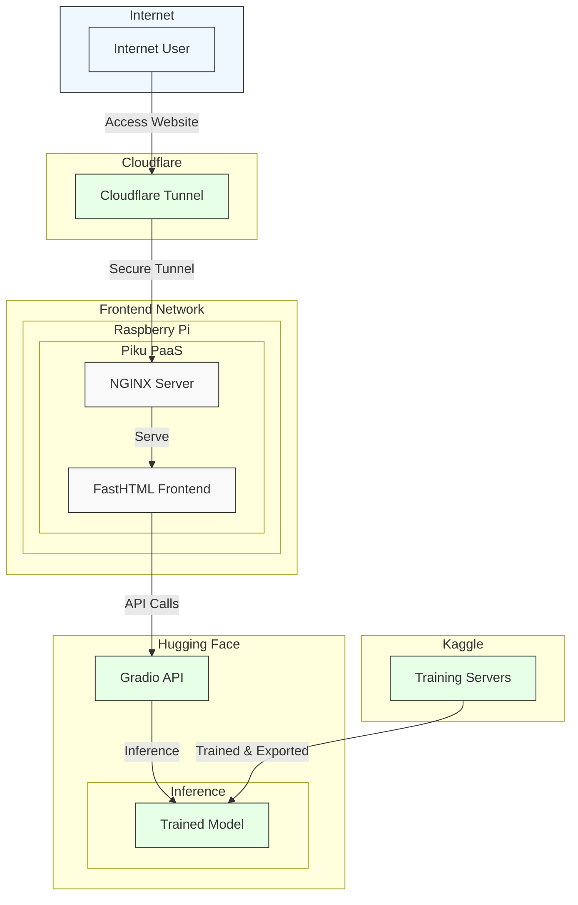

# SonicSight

Takes simple audio files, generates a spectrogram and uses an image classification model to identify the sound. Created this web application to display the model I trained, applying lessons 1 & 2 of the [fast.ai course](https://course.fast.ai). Currently, the model is trained to only recognized dog & cat sounds.

## Components

### Frontend

- FastHTML: Python frontend application/framework
- Raspberry Pi: Acts as home server hosting the application
- Piku: A lightweight Platform-as-a-Service (PaaS) running on Raspberry Pi
- NGINX: Web server that handles HTTP requests and serves content

### Network & Connectivity

- Cloudflare Tunnels: Securely exposes server to the internet without opening firewall ports

### Backend & AI (Cloud)

- Hugging Face Space: Hosts ML model and backend server for inference
- Gradio Client API: Provides the interface between frontend and the model
- Kaggle: Where I initially trained the model before deployment

### ML Model (training on Kaggle)

1. Loaded cat and dog audio files from ESC-50 and this [kaggle notebook](https://www.kaggle.com/datasets/mmoreaux/audio-cats-and-dogs)
2. Generated spectrograms using [librosa](https://github.com/librosa/librosa) and saved them to their respective directories for labelling
3. Defined a [DataBlock](https://docs.fast.ai/data.block.html) which is essentially a pipeline builder that lets you easily define:

   - What kind of data you have (images, text, tabular, etc.)
   - How to get your data (e.g., from folders, DataFrames, or lists)
   - How to split the data (e.g., train/validation sets)
   - How to apply transformations (e.g., data augmentation for images)
   - How to batch and load the data efficiently (using PyTorch DataLoader)

4. Fed data to a pretrained model, resnet50, a CNN designed for image classification and other computer vision tasks
5. Trained this model further to recognize spectrograms belonging to cats and dogs and apply _transfer learning_
6. Plotted the loss vs learning rate to reduce amount of guesswork on picking a good starting learning rate
7. Fine tuned the mode, which is fast.ai's way to simplify transfer learning. It automates steps such as learning rate scheduling, progressive unfreezing, and discriminative learning rates
8. Used an `EarlyStoppingCallback` to stop early when `valid_loss` stops improving and saving the model's best run during training and loads it at the end
9. Exported the model to use for inference
